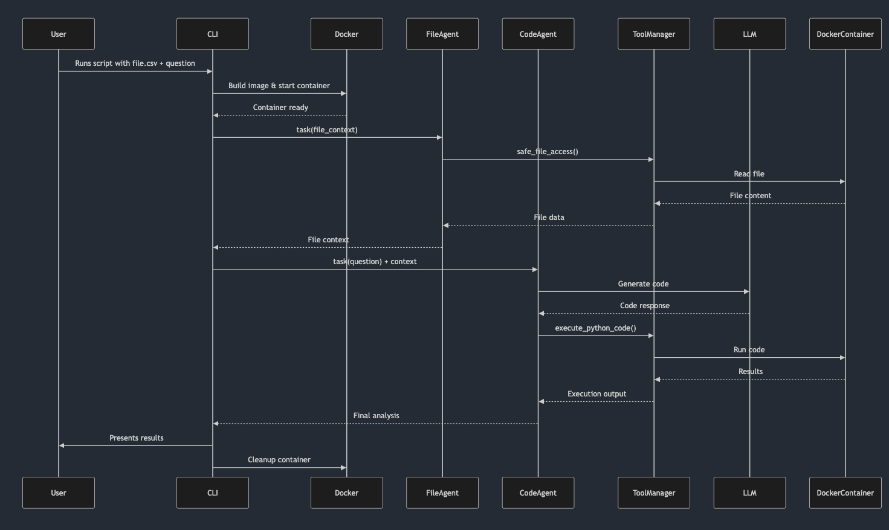
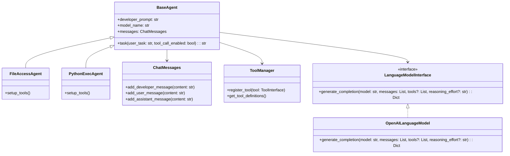
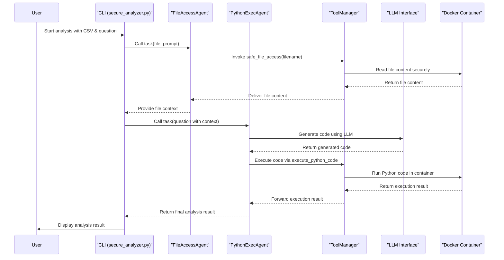

# 🛡️ Secure Data Analysis System

Secure Data Analysis System – Python-based solution for analyzing data files (csv) using advanced Language Models (LLMs) in a fully isolated docker container environment. By combining the power of OpenAI's language models like o3-mini with the enhanced security of Docker containerization, this system offers both cutting‐edge data insights and top-notch protection.

## ✨ Features

- **🔒 Secure File Access & Code Execution:** Executes code within isolated Docker containers, ensuring a safe and controlled environment for data analysis.
- **🤖 Intelligent Agents:** Utilizes OpenAI's language models to deliver sophisticated data understanding and processing.
- **🛠️ Extensible Tool System:** Easily extend functionality through a modular tool interface.
- **📊 Built-in Data Analysis Support:** Comes pre-equipped with libraries like `pandas`, `numpy`, `matplotlib`, and `seaborn` for comprehensive data exploration.
- **🔍 Detailed Logging & Error Tracking:** Provides in-depth logging to facilitate efficient debugging and monitoring.
- **🏗️ Clean, Object-Oriented Architecture:** Designed with a clear separation of concerns, aiding in scalability and maintainability.

## 🏛️ Architecture

### Core Components

1. **Agent System** (`resources/registry/agents/`):  
   - **BaseAgent:** The abstract base class for all agents.
   - **FileAccessAgent:** Manages secure file operations.
   - **PythonExecAgent:** Oversees code generation and execution within Docker containers.

2. **Services** (`resources/object_oriented_agents/services/`):  
   - **LanguageModelInterface:** An abstract interface for interacting with language models.
   - **OpenAILanguageModel:** A concrete implementation that leverages the OpenAI API.
   - **OpenAIClientFactory:** Handles the creation and management of OpenAI API clients.

3. **Utils** (`resources/object_oriented_agents/utils/`):  
   - **logger.py:** Provides a centralized logging system.
   - **openai_util.py:** Offers utility functions for interacting with the OpenAI API.

### Component Interactions Sequence Diagram

~~~mermaid
sequenceDiagram
    participant User
    participant CLI
    participant FileAgent
    participant CodeAgent
    participant LLM
    participant Docker

    User->>CLI: Run analysis
    CLI->>Docker: Start container
    CLI->>FileAgent: Read file
    FileAgent->>CLI: File content
    CLI->>CodeAgent: Generate & run code
    CodeAgent->>LLM: Request code
    LLM-->>CodeAgent: Return code
    CodeAgent->>Docker: Execute code
    Docker-->>CodeAgent: Results
    CodeAgent->>CLI: Analysis results
    CLI->>User: Display results
~~~

## 🚀 Getting Started

### Prerequisites

- Python 3.10+
- Docker
- An active OpenAI API key

### Installation

1. **Clone the Repository:**

   ```bash
   git clone https://github.com/yourusername/secure-data-analysis.git
   cd secure-data-analysis
   ```

2. **Install Dependencies:**

   ```bash
   python -m venv venv
   source venv/bin/activate  # On Windows: .\venv\Scripts\activate
   pip install -r requirements.txt
   ```

3. **Configure the OpenAI API:**

   ```bash
   export OPENAI_API_KEY='your-api-key-here'
   ```

### Basic Usage

Run the analyzer with a CSV file and your question:

```bash
python secure_analyzer.py --file your_data.csv --question "What are the monthly trends?"
```




## 🔒 Security Features

### 1. Docker Isolation

- Executes all code in isolated Docker containers.
- Runs with a non-root user.
- Enforces strict resource limits and network isolation.

### 2. File Access Security

```python
# Example from FileAccessAgent
def safe_file_access(self, filename: str) -> str:
    if not self._is_safe_path(filename):
        return "Error: Invalid file path"
    return self._read_file_safely(filename)
```

### 3. Language Model Security

```python
# From OpenAILanguageModel
def generate_completion(
    self,
    model: str,
    messages: List[Dict[str, str]],
    tools: Optional[List[Dict[str, Any]]] = None,
    reasoning_effort: Optional[str] = None
) -> Dict[str, Any]:
    try:
        response = self.openai_client.chat.completions.create(
            model=model,
            messages=messages,
            tools=tools
        )
        return response
    except Exception as e:
        self.logger.error(f"OpenAI call failed: {str(e)}", exc_info=True)
        raise
```

## 📖 Example Workflows

### 1. Basic Data Analysis

```bash
python secure_analyzer.py \
    --file sales_data.csv \
    --question "Show me the average sales by quarter"
```

### 2. Advanced Analysis with Visualization

```bash
python secure_analyzer.py \
    --file traffic_data.csv \
    --question "Create a line plot showing accidents over time_of_day"
```

## 🛠️ Development Guide

### Creating a New Tool

Implement the `ToolInterface` to add custom capabilities:

```python
from ...object_oriented_agents.core_classes.tool_interface import ToolInterface

class CustomAnalysisTool(ToolInterface):
    def get_definition(self) -> Dict[str, Any]:
        return {
            "function": {
                "name": "custom_analysis",
                "description": "Performs custom data analysis",
                "parameters": {
                    "type": "object",
                    "properties": {
                        "analysis_type": {"type": "string"},
                        "columns": {"type": "array", "items": {"type": "string"}}
                    },
                    "required": ["analysis_type", "columns"]
                }
            }
        }

    def run(self, arguments: Dict[str, Any]) -> str:
        # Implementation
        pass
```

### Creating a New Agent

Extend the base agent to create custom agents:

```python
from ...object_oriented_agents.core_classes.base_agent import BaseAgent

class CustomAnalysisAgent(BaseAgent):
    def __init__(
        self,
        developer_prompt: str = "Your custom prompt here",
        model_name: str = "gpt-4",
        logger=None,
        language_model_interface=None
    ):
        super().__init__(
            developer_prompt=developer_prompt,
            model_name=model_name,
            logger=logger,
            language_model_interface=language_model_interface
        )
        self.setup_tools()

    def setup_tools(self) -> None:
        self.tool_manager.register_tool(CustomAnalysisTool())
```

## 📝 Logging System

Our project utilizes a hierarchical logging system to streamline monitoring and debugging:

```python
from ...object_oriented_agents.utils.logger import get_logger

logger = get_logger(__name__)

# Usage examples
logger.info("Starting analysis...")
logger.debug("Processing file: %s", filename)
logger.error("Error in analysis", exc_info=True)
```

**Log Configuration:**

- **Log Level:** Configurable (DEBUG, INFO, ERROR)
- **Output:** Both console and file (`logs.log`)
- **Format:** `%(asctime)s - %(name)s - %(levelname)s - %(message)s`

## 🤝 Contributing

We welcome contributions! To get started:

1. Fork the repository.
2. Create your feature branch (`git checkout -b feature/NewFeature`).
3. Commit your changes (`git commit -m 'Add NewFeature'`).
4. Push to your branch (`git push origin feature/NewFeature`).
5. Open a Pull Request.

### Development Guidelines

- Adhere to the PEP 8 style guide.
- Include unit tests for new features.
- Update the documentation as needed.
- Maintain type hints and clear commit messages.

## 📄 License

This project is licensed under the MIT License – see the [LICENSE](LICENSE) file for details.

## 🙏 Acknowledgments

- OpenAI for their groundbreaking language models.
- Docker for delivering robust containerization.
- All contributors and users who help improve this project.

## 📞 Contact

Sharad Jain – [@seekingtroooth](https://x.com/seekingtroooth) – sharadsfo@gmail.com

Project Link: [https://github.com/Imsharad/openai-code-interpreter](https://github.com/Imsharad/openai-code-interpreter)

## 📚 Additional Resources

- [OpenAI API Documentation](https://platform.openai.com/docs/api-reference)
- [Docker Documentation](https://docs.docker.com/)
- [Python Packaging Documentation](https://packaging.python.org/)

## 📊 Detailed Diagrams

To help illustrate the architecture and workflow of the project, the following Mermaid diagrams offer a detailed look at the components and their interactions.

### 1. Component Class Diagram

This diagram shows the core classes, their relationships, and how the agent system is structured:



### 2. Detailed Sequence Diagram

This diagram describes a detailed flow of how an analysis request passes through the different components—from initial file access to code execution and results presentation:



### 3. High-Level Data Flow Diagram

This diagram provides an overview of the high-level data flow within the system—from user input to the execution results reflecting back to the user:

```mermaid
graph LR
    A[User Input: CSV file + Question]:::user
    B["CLI (secure-analyzer.py)"]:::cli
    C[FileAccessAgent]:::agent
    D[PythonExecAgent]:::agent
    E[ToolManager]:::service
    F["LLM (OpenAI API)"]:::external
    G[Docker Container]:::infra
    H[OpenAIClientFactory]:::service
    I[LanguageModelInterface]:::interface
    J[Logger]:::util
    K[SecurityValidator]:::security
    L[BaseAgent]:::abstract
    M[ChatMessages]:::data
    N[ToolInterface]:::interface
    O[PythonExecTool]:::tool
    P[FileAccessTool]:::tool
    
    subgraph Agents
        C
        D
        L
    end
    
    subgraph Services
        E
        H
        I
    end
    
    subgraph Security
        K
        G
    end

    subgraph Core Components
        M
        N
    end

    %% Main flow
    A --> B
    B --> C & D
    C & D --> E
    E --> K
    K --> E
    E --> G & I
    I --> H
    H --> F
    F --> H
    H --> I
    I --> E
    G --> E
    E --> D
    D --> B
    B --> A
    
    %% Class relationships
    L --> C & D
    L --> M
    L --> I
    E --> O & P
    O & P --> N
    J --> C & D & E

    classDef user fill:#c9f7d4,stroke:#2b6620;
    classDef cli fill:#fff4de,stroke:#a2790d;
    classDef agent fill:#d3ddfa,stroke:#1c3a94;
    classDef service fill:#e1d5f7,stroke:#5015a0;
    classDef external fill:#ffd8d8,stroke:#c90000;
    classDef infra fill:#d1f0f6,stroke:#0a708a;
    classDef util fill:#f0f0f0,stroke:#666666;
    classDef interface fill:#fce1e4,stroke:#d60047;
    classDef security fill:#ffebcc,stroke:#e67e00;
    classDef abstract fill:#f8f9fa,stroke:#adb5bd,stroke-dasharray: 5 5;
    classDef data fill:#e3f2fd,stroke:#1976d2;
    classDef tool fill:#f3e5f5,stroke:#9c27b0;

    click G href "https://docs.docker.com/engine/security/" "Docker Security Docs"
    click K href "#security-features" "Project Security Details"
    
    note["🔒 Security Layers:
    1. Path validation
    2. Docker isolation
    3. LLM output sanitization
    4. Resource limits"]:::security
    note -.- G